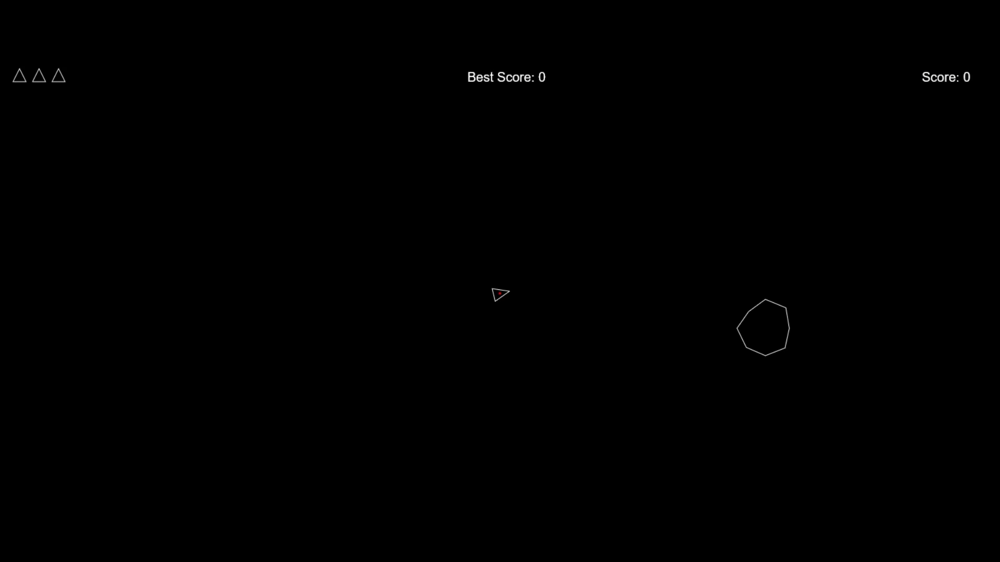
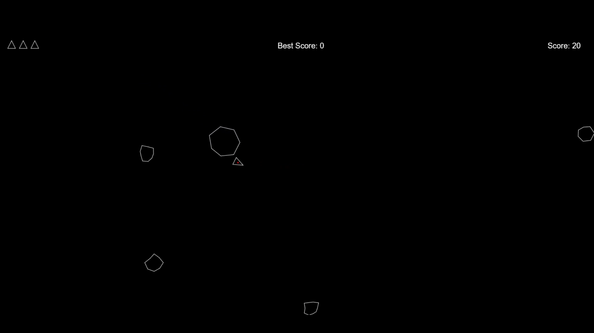

# Astron

**Astron** is a classic arcade-style space shooter built with vanilla **JavaScript** and **HTML5 Canvas**.

## Gameplay

Control a spaceship in a void filled with dangers. Thrust through space, rotate to aim, and survive as long as you can.

## Features

- **Physics-based Movement**: Momentum-based thrust and friction mechanics.
- **Screen Wrapping**: Fly off one side of the screen and appear on the other.
- **Retro Graphics**: Simple vector-style rendering using the HTML5 Canvas API.

## How to Play

1. Clone or download the repository.
2. Open `Scripts/index.html` in any modern web browser.
3. **Controls**:
   - **W**: Thrust forward
   - **A / D**: Rotate Left / Right
   - **Space**: Fire

## Tech Stack

- **HTML5 Canvas**: For high-performance 2D rendering.
- **JavaScript (ES6+)**: Game logic and state management.

## Project Structure

- `Scripts/game.js`: Contains the main game loop, player class, and physics logic.
- `Scripts/index.html`: The entry point for the game.

## Script Reference

### `Scripts/game.js`
The engine and logic of the game.
- **Canvas Setup**: Initializes the full-screen 2D context.
- **`class Player`**: Encapsulates ship state (position, velocity, rotation), rendering (drawing the vector ship), and physics (thrust, friction, screen wrapping).
- **Game Loop**: Manages the animation frame request cycle to update and draw the game state continuously.
- **Input Handling**: Listens for 'keydown' and 'keyup' events to manage smooth control states.

## Gallery

| | |
|:---:|:---:|
|  |  |
|  | |

## License

This project is licensed under the MIT License - see the [LICENSE](LICENSE) file for details.
Copyright (c) 2026 ARGUS